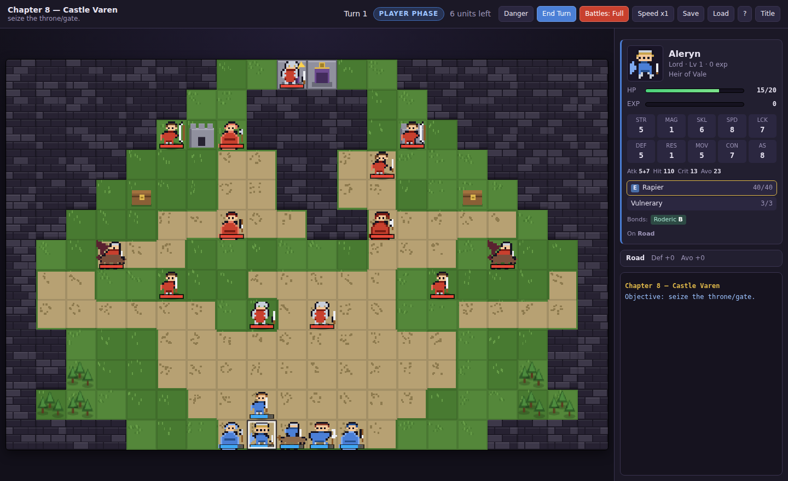
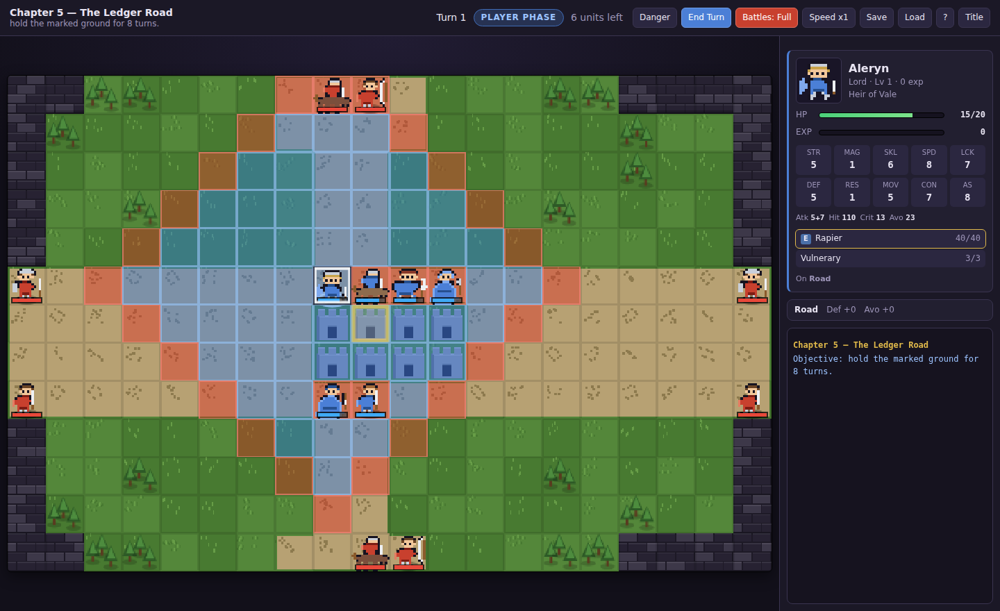
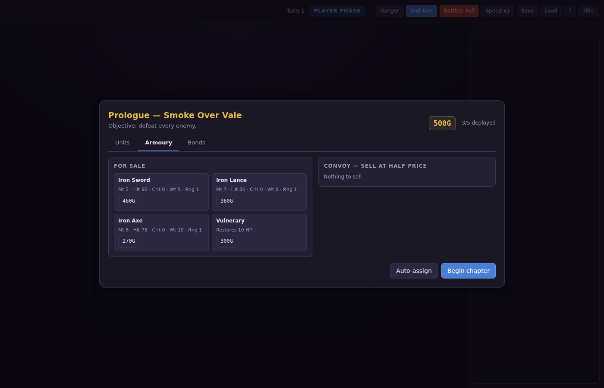
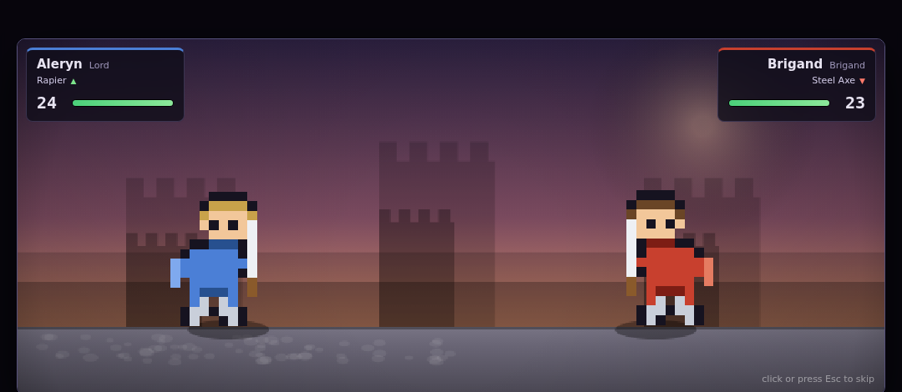

# The March of Vale

A turn-based tactics game in the spirit of the Fire Emblem series: grid maps, the weapon
triangle, supports, permanent death, and a nine-chapter campaign with an actual story.
It runs in any modern browser with no build step, no dependencies and no asset files.



## Play it

**Easiest:** clone or download the repo and open `index.html` in a browser. That's it —
saving to `localStorage` works from `file://` too.

**From a URL:** the repo ships a GitHub Pages workflow and `main` already has the game.
Go to **Settings → Pages** and set *Source* to **GitHub Actions**; it will then be served
at `https://eddu-beddu.github.io/Strategy/`.

**Locally over HTTP**, if you prefer:

```bash
python3 -m http.server 8000   # then open http://localhost:8000
```

## The campaign

Vale was not raided. It was sold. Nine chapters, four ways for it to go wrong, and a
last chapter you cannot win legally.

| # | Chapter | Objective | Introduces |
|---|---------|-----------|------------|
| — | Smoke Over Vale | Rout | Movement, the weapon triangle, terrain |
| 1 | The Long Road South | Defeat the commander | Talk-recruiting, villages, caches |
| 2 | Fords of the Aelin | Rout | Chokepoints, fliers over water, reinforcements |
| 3 | The Abbey of Saint Ede | **Escape** | Running from a fight you cannot win |
| 4 | The Iron Gate | Seize | Armour, effective weapons, a boss on a throne |
| 5 | The Ledger Road | **Defend** | Holding one tile against four directions |
| 6 | Windward Pass | Survive | Wave defence, fliers, forts |
| 7 | The Silver Vein | Rout | Tight corridors and a draining boss |
| 8 | Castle Varen | Seize | Everything at once |

Eleven recruitable units. Four of them — Kestrel, Sable, Bern, Elowen — only join if
Aleryn walks up to them and chooses **Talk**, and Hallow only joins in the mine. Miss
them and they are gone.



## Systems

- **Weapon triangle.** Swords beat axes, axes beat lances, lances beat swords: ±1 damage
  and ±15 hit. Magic runs anima → light → dark → anima. Physical weapons hit Defence,
  tomes hit Resistance.
- **Doubling.** 4 or more attack speed than your opponent and you strike twice. Attack
  speed is Speed minus the weapon's weight above your Constitution, so heavy weapons slow
  small units down.
- **Two-roll hit rates.** As in the GBA games, a displayed hit rate is the average of two
  rolls — so 80% lands far more often than 80% of the time, and 30% lands far less.
- **Supports.** Ten pairs of units build a bond by ending turns beside each other or
  fighting side by side. At C, B and A an adjacent partner is worth up to +15 hit,
  +15 avoid, +2 damage and +5 crit, and each rank unlocks a conversation. The forecast
  names the bond that is feeding the numbers.
- **Effective weapons.** Bows triple against fliers, hammers and armourslayers against
  armour, horseslayers and the Rapier against cavalry.
- **Terrain.** Forests, hills and mountains give avoid and defence; forts and thrones heal
  20% of max HP each turn; only fliers cross water.
- **Growth and promotion.** Units level on randomly rolled growth rates. At level 10 the
  right promotion item turns them into an advanced class with new weapon types.
- **Gold and an armoury.** Chapters pay out; the convoy sells back at half price; stock
  widens from iron through steel and staves to killer and silver weapons.
- **Permanent death.** A fallen unit is gone for the rest of the campaign, along with
  everything in their pack. *Forgiving mode* on the title screen turns this off.



## Battles

Combat cuts away to a side-view duel: wind-up, lunge, impact flash, screen shake, recoil.
Ranged weapons fire instead of closing — arrows arc, tomes throw a glowing orb — and
criticals get a white flash and a banner. Backdrops are built from the defender's terrain,
so a fight in a forest does not look like a fight on a bridge.



Skip any battle with a click or Esc, or turn the whole thing off with the **Battles**
button (or `B`) to go back to fast on-map combat. The outcome is settled before the
animation starts, so skipping never changes what happened.

## Quality of life

- **Danger zone** (`Q`) hatches every tile the enemy can reach next turn.
- **Undo a move** with right-click or `Esc`, right up until you commit to an action.
- **Battle forecast** shows damage, hit, crit and doubling for both sides, and flags when
  either side can kill.
- **Autosave** at the start of every turn plus a separate chapter-start save, so a defeat
  offers both *retry from this turn* and *restart the chapter*.
- **Speed toggle** for animations (x1 / x2 / x4).

## Controls

| Action | Mouse | Keyboard |
|---|---|---|
| Move the cursor | hover | arrows or `WASD` |
| Select / confirm | click | `Enter` or `Space` |
| Cancel / undo move | right-click | `Esc` |
| Cycle unused units | — | `Tab` |
| End turn | End Turn button | `E` |
| Toggle danger zone | Danger button | `Q` |
| Toggle battle scenes | Battles button | `B` |

Select a unit to see blue tiles (where it can move) and red tiles (where it can strike).
Hovering an enemy while a unit is selected shows the forecast for attacking it from the
best tile you can reach.

## Project layout

```
index.html        page shell
css/style.css     all styling
js/data.js        classes, growth rates, weapons, items, terrain, shop stock
js/sprites.js     fourteen 16x16 pixel-art matrices, palette-swapped per team
js/core.js        units, stats, inventory, experience, promotion
js/grid.js        the board, movement costs, pathfinding, threat ranges
js/combat.js      forecasts and battle resolution
js/supports.js    bonds, their bonuses, and thirty support conversations
js/ai.js          enemy decision making
js/render.js      canvas map drawing
js/battle.js      the side-view duel scene
js/ui.js          panels, menus, dialogs
js/maps.js        the campaign: nine chapters, the cast, the maps
js/story.js       opening, interludes, epilogues
js/game.js        turn flow, player actions, campaign state
```

Plain scripts on a global `FE` namespace — no modules, so it works straight off the file
system. No art or audio assets: every sprite, tile and backdrop is drawn procedurally at
load time.

## Notes on the implementation

- **The AI** scores every (tile, target) pair it can reach by expected damage, kill chance,
  damage taken and terrain, then picks the best. Guards hold until you enter their aggro
  radius, bosses hold their throne, staff users chase the wounded.
- **Combat is settled before it is shown.** `resolveCombat` rolls the whole exchange, then
  the HP is rewound and replayed by whichever presentation is active. Skipping an animation
  cannot change an outcome.
- **The RNG is a seeded xorshift**, so a run is reproducible if you seed it.
- **Maps are validated** at load for ragged rows, and by a test that checks every unit,
  village, cache and objective tile is on passable ground and reachable on foot.

## Credits

Written for this repository. Fire Emblem is Nintendo's; this is an original game that
borrows its tactics grammar, not its assets, characters or code.
