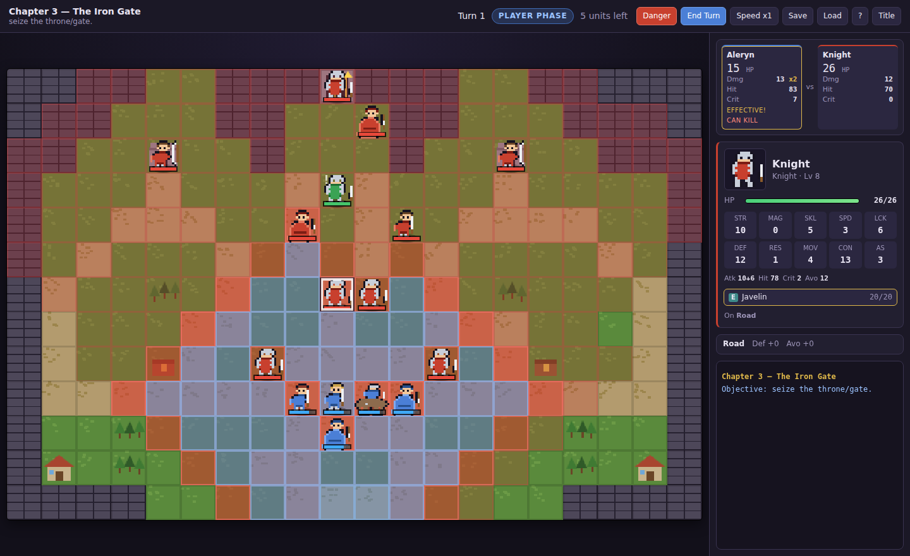

# The March of Vale

A turn-based tactics game in the spirit of the Fire Emblem series — grid maps, the
weapon triangle, permanent death, and a six-chapter campaign. It runs in any modern
browser with no build step, no dependencies and no server.


## Play it

**Easiest:** download or clone the repo and open `index.html` in a browser. That's it —
saving to `localStorage` works from `file://` too.

**From a URL:** the repo ships a GitHub Pages workflow. Once this branch is merged to
`main`, go to **Settings → Pages** and set *Source* to **GitHub Actions**. The game will
then be served at `https://<your-user>.github.io/Strategy/`.

**Locally over HTTP** (if you prefer):

```bash
python3 -m http.server 8000
# then open http://localhost:8000
```

## What's in it

Six chapters, four objective types, eleven recruitable units.

| # | Chapter | Objective | What it teaches |
|---|---------|-----------|-----------------|
| — | Smoke Over Vale | Rout | Movement, the weapon triangle, terrain |
| 1 | The Long Road South | Defeat the commander | Talk-recruiting, villages, caches |
| 2 | Fords of the Aelin | Rout | Chokepoints, fliers over water, reinforcements |
| 3 | The Iron Gate | Seize the gate | Armour, effective weapons, a boss on a throne |
| 4 | Windward Pass | Survive 9 turns | Holding ground, forts, wave defence |
| 5 | Castle Varen | Seize the throne | Everything at once |

### Systems

- **Weapon triangle.** Swords beat axes, axes beat lances, lances beat swords: ±1 damage
  and ±15 hit. Magic runs anima → light → dark → anima. Physical weapons hit Defence,
  tomes hit Resistance.
- **Doubling.** 4 or more attack speed than your opponent and you strike twice. Attack
  speed is Speed minus the weapon's weight above your Constitution, so heavy weapons slow
  small units down.
- **Two-roll hit rates.** Like the GBA games, a displayed hit rate is the average of two
  rolls — so 80% lands far more often than 80% of the time, and 30% lands far less. The
  displayed number is honest about the odds you *see*, not the odds you *get*.
- **Effective weapons.** Bows triple against fliers, hammers and armourslayers against
  armour, horseslayers and the Rapier against cavalry.
- **Terrain.** Forests, hills and mountains give avoid and defence; forts and thrones heal
  20% of max HP each turn; only fliers cross water.
- **Growth and promotion.** Units level up on randomly rolled growth rates. At level 10 the
  right promotion item turns them into an advanced class with new weapon types.
- **Weapon ranks.** E through A, earned by use; better ranks unlock better weapons.
- **Permanent death.** A fallen unit is gone for the rest of the campaign — along with
  everything in their pack. *Forgiving mode* on the title screen turns this off if you'd
  rather not reload.
- **Recruitment.** Units marked **!** join if Aleryn moves next to them and chooses *Talk*.

### Quality-of-life

- **Danger zone** (`Q`) paints every tile the enemy can reach next turn.

  

- **Undo a move** with right-click or `Esc` — right up until you commit to an action, the
  way the GBA games let you.
- **Battle forecast** shows damage, hit, crit and doubling for both sides before you commit,
  and flags when either side can kill.
- **Autosave** at the start of every turn, plus a separate chapter-start save, so a defeat
  offers both *retry from this turn* and *restart the chapter*.
- **Speed toggle** for animations (x1 / x2 / x4).

## Controls

| Action | Mouse | Keyboard |
|---|---|---|
| Move the cursor | hover | arrows or `WASD` |
| Select / confirm | click | `Enter` or `Space` |
| Cancel / undo move | right-click | `Esc` |
| Cycle unused units | — | `Tab` |
| End turn | End Turn button | `E` |
| Toggle danger zone | Danger button | `Q` |

Select a unit to see blue tiles (where it can move) and red tiles (where it can strike).
Click a destination, then pick an action. Hovering an enemy while a unit is selected shows
the forecast for attacking it from the best tile you can reach.

## Project layout

```
index.html        page shell
css/style.css     all styling
js/data.js        classes, growth rates, weapons, items, terrain
js/sprites.js     16x16 pixel-art matrices, palette-swapped per team
js/core.js        units, stats, inventory, experience, promotion
js/grid.js        the board, movement costs, pathfinding, threat ranges
js/combat.js      forecasts and battle resolution
js/ai.js          enemy decision making
js/render.js      canvas drawing
js/ui.js          panels, menus, dialogs
js/maps.js        the campaign: chapters, units, story
js/game.js        turn flow, player actions, campaign state
```

Plain scripts on a global `FE` namespace — no modules, so it works straight off the file
system. No art or audio assets: every sprite and tile is drawn procedurally at load time.

## Notes on the implementation

- **Battles resolve on the map** rather than cutting to a separate battle scene: units lunge,
  numbers float, HP bars drain. It keeps the board readable and the pace quick.
- **The AI** scores every (tile, target) pair it can reach by expected damage, kill chance,
  damage taken and terrain, then picks the best. Guards stay put until you enter their aggro
  radius, bosses hold their throne, staff users chase the wounded.
- **The RNG is a seeded xorshift**, so a run is reproducible if you seed it.

## Credits

Written for this repository. Fire Emblem is Nintendo's; this is an original game that
borrows its tactics grammar, not its assets, characters or code.
